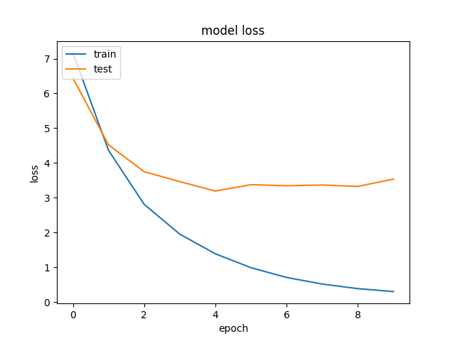

# QuantizationAwareFaceRecWithTF2

## Cloning and running instructions
To clone this repo run the following command:

`git clone https://github.com/jdsgomes/QuantizationAwareFaceRecWithTF2.git`

To start the training script:

`python train.py [dataset_directory]`

To start the quatization aware training script:

`python train_quantization_aware.py [dataset_directory]`

# Neural network architecture and loss
The model architecture used in these training scripts is the mobilenet V2 and the loss function is the sparse_categorical_crossentropy because I treated this problem as a classification problem and my labels are indexes rather than one-hot encoded indexes.

I am aware of the limitations of using this setup to train a model of more that 10k labels, and limited number of samples per label, but this was chosen as a proof of concept of a face regonition system gven the limited time. 

The loss I would chose for a larger projet would be the triplet loss, which has widely used in this kind of tasks.

# Train & validation loss
As seen in the graph bellow, te train loss lowered nicelly with every step. I trained for 10 epochs and the loss continually decayed.

