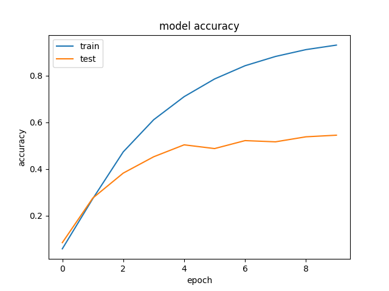
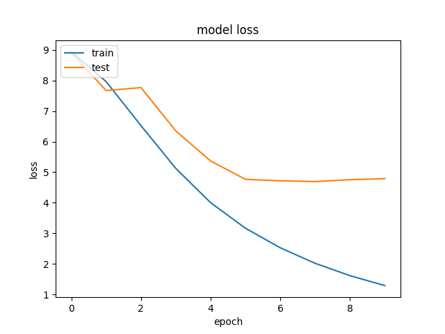
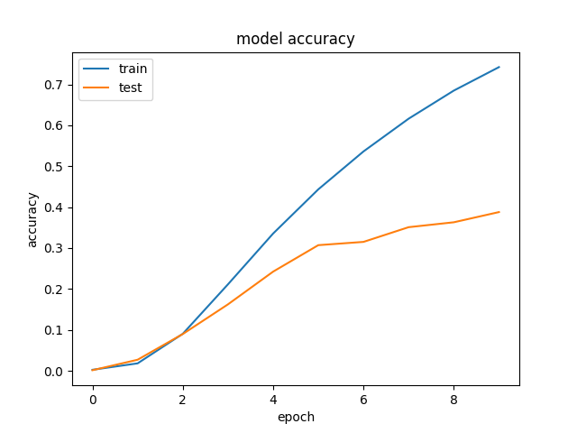

# QuantizationAwareFaceRecWithTF2

## Dependencies
Tensorflow 2.0 beta (and tensorflow 1.4 for the quantization aware training)
matplotlib 3.1.1
sklearn 0.21.2

## Cloning and running instructions
To clone this repo run the following command:

`git clone https://github.com/jdsgomes/QuantizationAwareFaceRecWithTF2.git`

To start the training script:

`python train.py [dataset_directory]`

To start the quatization aware training script:

`python train_quantization_aware.py [dataset_directory]`

## Neural network architecture and loss
The model architecture used in these training scripts is the mobilenet V2 and the loss function is the sparse_categorical_crossentropy because I treated this problem as a classification problem and my labels are indexes rather than one-hot encoded indexes.

I am aware of the limitations of using this setup to train a model of more that 10k labels, and limited number of samples per label, but this was chosen as a proof of concept of a face regonition system gven the limited time. 

The loss I would chose for a larger projet would be the triplet loss, which has widely used in this kind of tasks.

## Train & validation loss
As seen in the graph bellow, te train loss lowered nicelly with every step. I trained for 10 epochs and the loss continually decayed.
The validations loss stopped decaying around epoch 4, which indicates that the model stopped generalizing and starts to overfit slowly. 

## Quantization aware train and validation
I introduced quantization awareness after 4 epochs (~14k iterations) to allow the model to be fully trainned first and then introduce the quatization aware finetuning of the trained model.

Two observations form the loss/accuracy plots bellow:

1. In this mode, the performance increase is slower than with the normal mode, but from the curves it seems that it is possible that by training longer we would achieve a similar performance.
2. I would expect to see an effect on the curves after epoch 4 regarding the introduction of the quantization aware trainnig, but for some reason this effect shows up between epoch 1 and 2 in the loss curve. Unfortunatlly due to lack of time I didn't investigate this issue further. 

In order to introduce the quantization aware training I used tensorflow 1.4 as in tf 2.0 there is no clear way to set the backend session for keras.

